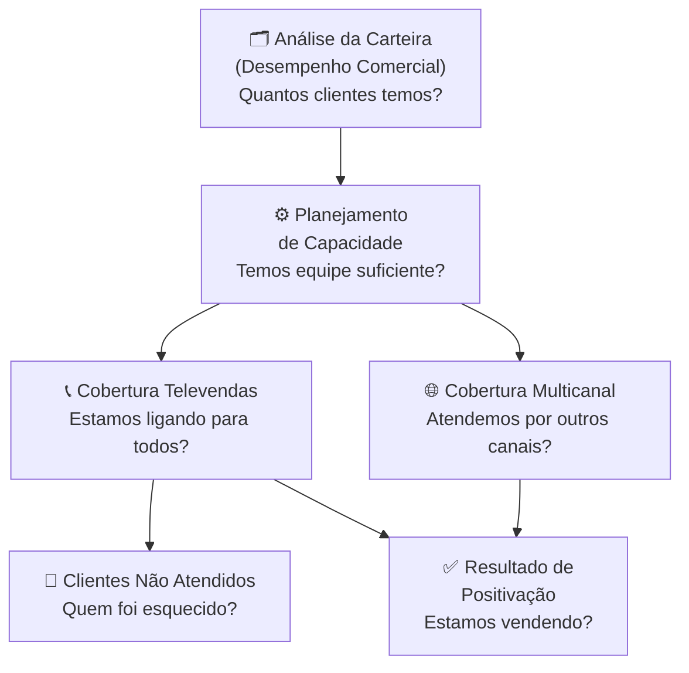

# 📊 Roteiro de Treinamento: Relatórios GoVendas
## Capacitando Gestores e Equipes de Televendas para Análise de Dados Comerciais

---

> [!IMPORTANT]
> **Público-alvo:** Gestores de equipes de televendas e vendedores que utilizam o sistema GoVendas.
> **Duração estimada:** 4 a 6 horas (pode ser dividido em módulos)
> **Formato:** Presencial ou online, com acesso simultâneo ao sistema

---

## 📋 SUMÁRIO

1. [Introdução](#1-introdução)
2. [Mapa Geral dos Relatórios](#2-mapa-geral-dos-relatórios)
3. [Ordem de Aprendizado](#3-ordem-de-aprendizado)
4. [Treinamento Detalhado por Relatório](#4-treinamento-detalhado-por-relatório)
   - [Módulo 1 – Análise da Carteira (Desempenho Comercial)](#módulo-1--desempenho-comercial---validação-evolução-da-carteira)
   - [Módulo 2 – Capacidade de Atendimento](#módulo-2--planejamento-de-capacidade)
   - [Módulo 3 – Cobertura de Atendimento Televendas](#módulo-3--cobertura-de-atendimento---televendas)
   - [Módulo 4 – Clientes Não Atendidos por Vendedor](#módulo-4--clientes-não-atendidos-por-vendedor)
   - [Módulo 5 – Resultado de Positivação](#módulo-5--resultados-de-positivação)
   - [Módulo 6 – Performance Comercial Multicanal](#módulo-6--cobertura-de-atendimento-multicanal---validação)
5. [Cenários Práticos de Gestão](#5-cenários-práticos-de-gestão)
6. [Exercícios de Análise](#6-exercícios-de-análise)
7. [Conclusão – O Dia a Dia do Gestor](#7-conclusão--o-dia-a-dia-do-gestor)

---

## 1. INTRODUÇÃO

### 🎯 Por que analisar relatórios?

Imagine que você é o capitão de um navio, mas sem GPS, sem mapas e sem visibilidade do tempo. Como você saberia se está indo na direção certa?

**Os relatórios do GoVendas são exatamente o GPS da sua operação comercial.**

Sem eles, você gerencia no escuro. Com eles, você enxerga:
- Onde estão os problemas **antes** que eles se agravem
- Quais vendedores precisam de suporte
- Quantos clientes estão sendo abandonados
- Se a sua equipe tem capacidade para atender a demanda
- Se os atendimentos estão gerando vendas

### 🏢 O que é o GoVendas?

O GoVendas é um sistema de gestão comercial focado em **televendas**. Ele organiza:
- A carteira de clientes de cada vendedor
- O agendamento e planejamento de atendimentos
- Os resultados de vendas e positivação
- A cobertura da operação por canal

### 👥 Quem deve usar os relatórios?

| Perfil | Uso Principal |
|--------|---------------|
| **Gestor / Supervisor** | Análise diária, tomada de decisão, acompanhamento de equipe |
| **Coordenador** | Visão consolidada da operação, planejamento estratégico |
| **Vendedor** | Consulta pontual do próprio desempenho |

> [!NOTE]
> Os relatórios foram projetados **principalmente para o gestor**. São ele quem interpreta os dados e orienta a equipe.

---

## 2. MAPA GERAL DOS RELATÓRIOS

### Como os relatórios se conectam?



### 🧭 A lógica da análise (da visão macro ao detalhe)

```
VISÃO GERAL → CAPACIDADE → EXECUÇÃO → PROBLEMA → RESULTADO
     ↓              ↓           ↓           ↓           ↓
Carteira      Planejam.    Cobertura   Não Atendidos  Positivação
```

**Leitura simples:** Primeiro eu sei **quantos** clientes tenho → depois vejo se tenho **gente suficiente** para atendê-los → depois verifico se **estão ligando** → identifico quem **ficou para trás** → e por fim, vejo se os atendimentos estão **gerando vendas**.

---

## 3. ORDEM DE APRENDIZADO

| # | Relatório | Por que aprender nessa ordem |
|---|-----------|-------------------------------|
| 1 | Desempenho Comercial – Evolução da Carteira | Entender o "tamanho do território" antes de analisar operação |
| 2 | Planejamento de Capacidade | Entender se a equipe consegue cobrir esse território |
| 3 | Cobertura de Atendimento Televendas | Ver se o plano está sendo executado |
| 4 | Clientes Não Atendidos por Vendedor | Identificar falhas na execução |
| 5 | Resultado de Positivação | Medir a qualidade dos atendimentos realizados |
| 6 | Cobertura de Atendimento Multicanal | Visão completa considerando todos os canais |

---

## 4. TREINAMENTO DETALHADO POR RELATÓRIO

---

### MÓDULO 1 – Desempenho Comercial - Validação (Evolução da Carteira)

**📍 Onde encontrar:** Relatórios → **Desempenho Comercial - Validação**

---

#### 🔬 Método Feynman – Explicação Simples

> Imagine que você tem uma loja e quer saber quantos clientes compram de você cada mês. Esse relatório te diz exatamente isso: quantos clientes estão ativos, ou seja, comprando da empresa. É o "termômetro" do tamanho da sua operação comercial.

---

#### 📋 5W2H – Visão Completa

| Pergunta | Resposta |
|----------|----------|
| **O que é** | Relatório que mostra a evolução da base de clientes ativos da carteira comercial |
| **Por que existe** | Para monitorar se a base de clientes está crescendo, estabilizada ou encolhendo ao longo do tempo |
| **Onde encontrar** | Relatórios → Desempenho Comercial - Validação |
| **Quando utilizar** | Mensalmente, e sempre que houver suspeita de queda no volume de negócios |
| **Quem utiliza** | Gestores, coordenadores e diretores comerciais |
| **Como interpretar** | Comparar o número de clientes ativos mês a mês. Quedas consecutivas indicam problema |
| **Qual impacto gera** | Decisão de expansão de carteira, redistribuição de territórios, contratação de vendedores |

---

#### 🖥️ Como ler o relatório

**Filtros disponíveis:**
- **Filtro de Data:** Selecionar o período de análise (ex: últimos 6 meses)
- **Supervisores:** Filtrar por supervisor específico
- **Vendedores:** Filtrar por vendedor específico

**Indicadores principais:**
| Indicador | O que significa |
|-----------|----------------|
| **Mês de Referência** | Mês sendo analisado |
| **Total de Clientes** | Total de clientes ativos no período selecionado |
| **Evolução mês a mês** | Variação da base de clientes ao longo do tempo |

---

#### ✅ Como usar para decisão

- **Base crescendo:** Operação saudável. Manter estratégia.
- **Base estável:** Verificar se a estabilização é saudável ou se há churning que mascara crescimento.
- **Base caindo:** Alerta! Investigar com os demais relatórios qual é a causa.

#### ⚠️ Erros comuns de interpretação
- Confundir "clientes cadastrados no ERP" com "clientes ativos". O total cadastrado pode ser maior que os ativos.
- Analisar apenas um mês isolado sem olhar a tendência histórica.

---

### MÓDULO 2 – Planejamento de Capacidade

**📍 Onde encontrar:** Relatórios → **Planejamento de Capacidade**

---

#### 🔬 Método Feynman – Explicação Simples

> Imagine que você tem 10 garçons em um restaurante, mas 200 mesas para servir. Claramente, os garçons não vão conseguir atender todo mundo bem. Esse relatório te diz exatamente isso: se cada vendedor tem capacidade (tempo e volume) suficiente para atender os clientes da sua carteira.

---

#### 📋 5W2H – Visão Completa

| Pergunta | Resposta |
|----------|----------|
| **O que é** | Relatório que compara a capacidade de atendimento do vendedor com o volume de clientes na carteira |
| **Por que existe** | Para identificar sobrecarga ou ociosidade na equipe antes que virem problemas |
| **Onde encontrar** | Relatórios → Planejamento de Capacidade |
| **Quando utilizar** | Antes do início de cada ciclo (mês) e ao redistribuir carteiras |
| **Quem utiliza** | Gestores, coordenadores e RH comercial |
| **Como interpretar** | Comparar a capacidade total do vendedor com o número de clientes agendados |
| **Qual impacto gera** | Redistribuição de carteiras, ajuste de metas, contratação ou rebalanceamento da equipe |

---

#### 🖥️ Como ler o relatório

**Filtros disponíveis:**
- **Supervisores:** Selecionar o supervisor
- **Vendedor selecionado:** Análise individual por vendedor
- **Tolerância:** Margem de ajuste (padrão: 0.10 = 10%)

**Indicadores principais:**
| Indicador | O que significa |
|-----------|----------------|
| **Vend. Cadastrados** | Quantidade total de vendedores na equipe |
| **Capacidade de Atendimento Diário** | Quantos clientes o vendedor consegue atender por dia |
| **Dias Úteis** | Dias de trabalho no mês |
| **Capacidade Total** | = Capacidade Diária × Dias Úteis |
| **Status do Planejamento** | Avaliação automática do sistema |

**Status possíveis:**

| Status | Significado | O que fazer |
|--------|-------------|-------------|
| ✅ **Dentro da capacidade** | Equilíbrio entre clientes e capacidade | Manter |
| ⚠️ **Clientes acima da capacidade** | Sobrecarga — vendedor não vai conseguir atender tudo | Redistribuir clientes |
| ℹ️ **Não há clientes elegíveis** | Vendedor está ocioso ou sem clientes planejados | Revisar carteira |

---

#### ✅ Como usar para decisão

**Antes de iniciar o mês:**
1. Selecione cada vendedor
2. Verifique o status do planejamento
3. Se houver sobrecarga, redistribua clientes entre vendedores com folga

#### ⚠️ Erros comuns de interpretação
- Ignorar o campo de Tolerância — ele impacta o status. Uma tolerância de 0.10 significa que até 10% acima da capacidade ainda é considerado aceitável.
- Analisar apenas o número total sem considerar o tipo de cliente (churn, ativo, novo).

---

### MÓDULO 3 – Cobertura de Atendimento - Televendas

**📍 Onde encontrar:** Relatórios → **Cobertura de Atendimento - Televendas**

---

#### 🔬 Método Feynman – Explicação Simples

> Imagine que você agendou 100 consultas médicas para o mês. No fim, apenas 60 pacientes foram consultados. A "cobertura" foi de 60%. Esse relatório te diz: dos clientes que foram planejados para ser atendidos pelos televendedores, **quantos realmente foram contatados**.

---

#### 📋 5W2H – Visão Completa

| Pergunta | Resposta |
|----------|----------|
| **O que é** | Relatório que mede o percentual de clientes agendados que foram efetivamente atendidos no canal televendas |
| **Por que existe** | Para garantir que o planejamento de atendimento está sendo executado pela equipe |
| **Onde encontrar** | Relatórios → Cobertura de Atendimento - Televendas |
| **Quando utilizar** | Semanalmente durante o mês e na avaliação mensal da equipe |
| **Quem utiliza** | Gestores de televendas e supervisores de equipe |
| **Como interpretar** | Comparar Agendados vs. Atendidos. Calcular o percentual de cobertura. |
| **Qual impacto gera** | Identificar equipes ou vendedores que não estão cumprindo o planejamento |

---

#### 🖥️ Como ler o relatório

**Filtros disponíveis:**
- **Filtro de Data:** Padrão "último mês" (recomendado)
- **Supervisores e Vendedores:** Filtro hierárquico
- **Tipo de Agendamento:**
  - **Planejado (carteira):** Clientes regulares da carteira
  - **Ruptura:** Clientes que não compraram no período esperado
  - **Complementar:** Clientes adicionados para complementar a agenda

**KPIs (indicadores-chave):**

| KPI | O que significa | Meta sugerida |
|----|----------------|---------------|
| **Agendados** | Total de clientes que deveriam ser atendidos no período | — |
| **Atendidos** | Clientes que efetivamente receberam atendimento | — |
| **Cobertura (%)** | Atendidos ÷ Agendados × 100 | > 80% |
| **Positivação (%)** | Atendimentos que geraram venda | > 60% |

---

#### 📊 Como interpretar os números

```
Agendados: 100 clientes
Atendidos: 75 clientes
Cobertura: 75%  ← Aceitável, mas monitorar

Positivação: 45 de 75
Taxa de Positivação: 60%  ← Meta atingida
```

#### ✅ Como usar para decisão
- **Cobertura abaixo de 70%:** Reunião urgente com a equipe. Identificar o gargalo.
- **Cobertura alta, positivação baixa:** O vendedor liga, mas não vende. Problema de abordagem ou produto.
- **Cobertura baixa em tipo "Ruptura":** Clientes em risco de churn sendo ignorados.

#### ⚠️ Erros comuns de interpretação
- Comparar cobertura de meses com número de dias úteis diferentes sem ajuste.
- Confundir os tipos de agendamento — um 0 em "Planejado" pode ser normal se o foco do mês foi "Ruptura".

---

### MÓDULO 4 – Clientes Não Atendidos por Vendedor

**📍 Onde encontrar:** Relatórios → **Clientes Não Atendidos por Vendedor**

---

#### 🔬 Método Feynman – Explicação Simples

> Se você contratar um entregador para entregar encomendas e algumas não chegarem, você quer saber quais encomendas ficaram para trás e **de qual entregador**. Esse relatório te diz exatamente isso: quais clientes foram agendados mas não receberam contato, e qual vendedor era o responsável.

---

#### 📋 5W2H – Visão Completa

| Pergunta | Resposta |
|----------|----------|
| **O que é** | Lista detalhada de clientes agendados que não compraram nem foram atendidos por nenhum canal de vendas |
| **Por que existe** | Para identificar, com nome e responsável, cada cliente que "caiu no vazio" no mês |
| **Onde encontrar** | Relatórios → Clientes Não Atendidos por Vendedor |
| **Quando utilizar** | Durante o mês (para corrigir em tempo real) e ao final do mês (para análise) |
| **Quem utiliza** | Gestores e supervisores de televendas |
| **Como interpretar** | Listar clientes por vendedor. Verificar padrões — vendedor com muitos não atendidos precisa de suporte |
| **Qual impacto gera** | Ação corretiva imediata: redistribuir clientes, cobrar vendedor, ajustar carteira |

---

#### 🖥️ Como ler o relatório

**Filtros disponíveis:**
- **Filtro de Data:** Últimos 6 meses (padrão) — pode ser ajustado
- **Supervisores:** Selecionar múltiplos supervisores
- **Vendedores:** Selecionar múltiplos vendedores

**O que você verá:**
- **Gráfico:** Quantidade de clientes agendados e não atendidos por vendedor
- **Tabela detalhada:** "Lista Detalhada de Clientes Agendados e Não Atendidos no Mês"
  - Nome do cliente
  - Vendedor responsável
  - Data do agendamento
  - Motivo (quando disponível)

---

#### 🔍 Como analisar a lista

**Passo a passo:**
1. Filtre pelo mês atual
2. Identifique os vendedores com mais clientes não atendidos
3. Para cada vendedor com alto número, pergunte: por quê?
   - Ausência? 
   - Sobrecarga de carteira? 
   - Falta de organização?
4. Tome a ação adequada

#### ✅ Como usar para decisão

| Situação | Ação recomendada |
|----------|-----------------|
| 1 vendedor com muitos não atendidos | Conversa individual. Verificar capacidade e organização |
| Toda equipe com não atendidos | Problema sistêmico — excesso de clientes agendados para a equipe |
| Clientes específicos nunca atendidos | Revisar se o cliente ainda está ativo ou deve sair da carteira |

#### ⚠️ Erros comuns de interpretação
- Não diferenciar **ausência temporária** (vendedor de férias) de **baixa produtividade**.
- Culpar o vendedor sem verificar se a carteira estava sobrecarregada (use o Planejamento de Capacidade primeiro).

---

### MÓDULO 5 – Resultados de Positivação

**📍 Onde encontrar:** Relatórios → **Resultados de Positivação**

---

#### 🔬 Método Feynman – Explicação Simples

> Ligar para o cliente é o começo. Fechar a venda é o objetivo. "Positivar" significa que o cliente comprou. Esse relatório te diz: dos clientes que foram atendidos, **quantos realmente compraram**. É a medida da qualidade da venda, não só da quantidade.

---

#### 📋 5W2H – Visão Completa

| Pergunta | Resposta |
|----------|----------|
| **O que é** | Relatório que mede a taxa de conversão em vendas dos clientes atendidos |
| **Por que existe** | Para avaliar a eficácia da abordagem comercial — não basta atender, tem que vender |
| **Onde encontrar** | Relatórios → Resultados de Positivação |
| **Quando utilizar** | Mensalmente e ao avaliar períodos de baixa em vendas |
| **Quem utiliza** | Gestores, supervisores e coordenadores comerciais |
| **Como interpretar** | Analisar a taxa de positivação por vendedor e por período. Comparar com meses anteriores |
| **Qual impacto gera** | Identificar necessidade de treinamento de vendas, revisão de mix de produtos, ou mudança de abordagem |

---

#### 🖥️ Como ler o relatório

**Filtros disponíveis:**
- **Filtro de Data:** Último ano (padrão) — permite visão histórica
- **Supervisores e Vendedores:** Filtro para análise individual ou de equipe

**Visualizações:**
- **Gráficos mensais:** Taxa de positivação ao longo do tempo
- **Comparativo por vendedor:** Quem converte mais e menos

---

#### 📊 Entendendo a taxa de positivação

```
Total atendidos no mês: 150 clientes
Clientes que compraram: 90 clientes
Taxa de Positivação: 90 ÷ 150 = 60%
```

**Referências de avaliação:**

| Taxa | Avaliação | Ação |
|------|-----------|------|
| > 70% | 🟢 Excelente | Manter e replicar boas práticas |
| 50–70% | 🟡 Aceitável | Monitorar e buscar melhoria |
| 30–50% | 🟠 Preocupante | Treinamento de técnicas de venda |
| < 30% | 🔴 Crítico | Ação imediata — revisar abordagem, produto e processo |

#### ✅ Como usar para decisão
- **Queda brusca em um mês:** Verificar se houve problema externo (crise, desabastecimento, concorrência).
- **Queda gradual:** Sinal de desmotivação ou desatualização da equipe.
- **Vendedor com positivação muito abaixo da média:** Candidato a treinamento individual.

#### ⚠️ Erros comuns de interpretação
- Comparar positivação de períodos com volumes de atendimento muito diferentes.
- Ignorar o tipo de cliente — positivar clientes novos é sempre mais difícil que clientes de carteira.

---

### MÓDULO 6 – Cobertura de Atendimento Multicanal - Validação

**📍 Onde encontrar:** Relatórios → **Cobertura de Atendimento Multicanal - Validação**

---

#### 🔬 Método Feynman – Explicação Simples

> Um cliente pode comprar pela loja física, pelo app, pelo representante ou pelo televendas. Se você olhar só para o televendas, pode achar que ele "não foi atendido" — quando na verdade ele comprou pelo e-commerce. Esse relatório te dá a visão completa: o cliente foi atendido por **qualquer** canal?

---

#### 📋 5W2H – Visão Completa

| Pergunta | Resposta |
|----------|----------|
| **O que é** | Relatório que mede a cobertura de atendimento considerando todos os canais de venda integrados ao GoVendas |
| **Por que existe** | Para não punir vendedores por clientes que compraram por outros canais, e para entender a operação completa |
| **Onde encontrar** | Relatórios → Cobertura de Atendimento Multicanal - Validação |
| **Quando utilizar** | Mensalmente, especialmente em operações com múltiplos canais de venda |
| **Quem utiliza** | Gestores e coordenadores que supervisionam mais de um canal |
| **Como interpretar** | Comparar Clientes na Carteira vs. Clientes Atendidos Multicanal |
| **Qual impacto gera** | Visão mais justa da cobertura real, ajudando a separar "não atendidos" de "atendidos por outro canal" |

---

#### 🖥️ Como ler o relatório

**Indicadores principais:**

| KPI | O que significa |
|----|----------------|
| **Clientes na Carteira** | Total de clientes vinculados à operação |
| **Clientes Atendidos Multicanal** | Clientes que tiveram contato/compra por qualquer canal |
| **Cobertura Multicanal (%)** | Percentual da carteira atingido por algum canal |

---

#### 🔄 Comparando Televendas vs. Multicanal

| Situação | O que indica |
|----------|-------------|
| Cobertura Multicanal > Cobertura Televendas | Clientes sendo atendidos por outros canais — positivo para o negócio |
| Cobertura Multicanal ≈ Cobertura Televendas | Canal televendas é o principal responsável — atenção à dependência |
| Cobertura Multicanal baixa em todos | Problema sério — a empresa não está chegando aos clientes por nenhum canal |

#### ✅ Como usar para decisão
- Use este relatório **depois** do de Cobertura Televendas para entender o contexto completo.
- Se um cliente aparece como "não atendido" no televendas mas foi atendido no multicanal, a prioridade de ação é menor.

#### ⚠️ Erros comuns de interpretação
- Usar este relatório isoladamente sem cruzar com o de Cobertura Televendas.
- Considerar que cobertura multicanal alta significa que o televendas está dispensável — eles têm papéis complementares.

---

## 5. CENÁRIOS PRÁTICOS DE GESTÃO

### 🎯 Como usar os relatórios para resolver problemas reais

---

#### 🔴 Cenário 1: "As vendas caíram neste mês. O que está acontecendo?"

**Diagnóstico passo a passo:**

```
1. Acesse: Resultado de Positivação
   → A taxa de positivação caiu?
   
2. Se SIM → Acesse: Cobertura de Atendimento - Televendas
   → A cobertura também caiu? Os vendedores estão ligando menos?
   
3. Se a cobertura caiu → Acesse: Clientes Não Atendidos por Vendedor
   → Quais vendedores têm mais clientes não atendidos?
   
4. Se a cobertura está boa mas a positivação caiu → Problema de abordagem/produto
   → Ação: Treinamento de vendas ou revisão de mix
```

---

#### 🔴 Cenário 2: "Um vendedor específico está com resultados muito abaixo dos demais"

**Diagnóstico:**

```
1. Acesse: Planejamento de Capacidade → Selecione o vendedor
   → Sua carteira está sobrecarregada?

2. Acesse: Clientes Não Atendidos por Vendedor → Filtre pelo vendedor
   → Quantos clientes ele não atendeu?

3. Acesse: Cobertura de Atendimento - Televendas → Filtre pelo vendedor
   → Qual é a taxa de cobertura e positivação dele?

4. Com base no diagnóstico:
   - Sobrecarga → Redistribuir carteira
   - Organização ruim → Coaching e acompanhamento
   - Técnica de venda fraca → Treinamento
```

---

#### 🔴 Cenário 3: "Estamos planejando ampliar a carteira. Posso adicionar mais clientes?"

**Diagnóstico:**

```
1. Acesse: Planejamento de Capacidade
   → Verifique o status de cada vendedor
   → Quem tem folga de capacidade?

2. Acesse: Análise da Carteira / Desempenho Comercial
   → Quantos clientes já estamos cobrindo?

3. Decida: 
   - Se há capacidade ociosa → Adicionar clientes distribuídos proporcionalmente
   - Se todos estão na capacidade máxima → Contratar novos vendedores antes
```

---

#### 🔴 Cenário 4: "O relatório de cobertura televendas mostra queda, mas os vendedores dizem que estão atendendo"

**Diagnóstico:**

```
1. Acesse: Cobertura de Atendimento Multicanal - Validação
   → Os clientes estão sendo atendidos por outros canais?

2. Se Multicanal está OK mas Televendas está baixo:
   → Clientes estão migrando para outros canais
   → Ação: Avaliar estratégia omnichannel e reforçar o papel do televendas

3. Se Multicanal também está baixo:
   → Confirmar a veracidade dos registros no sistema
   → Verificar se os atendimentos estão sendo registrados corretamente
```

---

## 6. EXERCÍCIOS DE ANÁLISE

### 📝 Exercício 1 – Interpretação de Cobertura

> **Situação:** O relatório de Cobertura de Atendimento Televendas mostra:
> - Agendados: 200 clientes
> - Atendidos: 130 clientes
> - Cobertura: 65%
> - Positivação: 78%

**Perguntas:**
1. A cobertura está em um nível aceitável? Por quê?
2. O índice de positivação é preocupante? Por quê?
3. Qual deveria ser a próxima ação do gestor?

**Gabarito:**
1. 65% está abaixo do ideal (>80%). Requer investigação dos clientes não atendidos.
2. Não — 78% de positivação é excelente. Os vendedores que ligam, vendem bem.
3. Acessar "Clientes Não Atendidos por Vendedor" para identificar quem não está cumprindo o planejamento.

---

### 📝 Exercício 2 – Diagnóstico de Capacidade

> **Situação:** O Planejamento de Capacidade mostra que o Vendedor X tem:
> - Capacidade Diária: 15 clientes
> - Dias Úteis: 22
> - Capacidade Total: 330 clientes
> - Clientes na Carteira: 520 clientes
> - Status: CLIENTES ACIMA DA CAPACIDADE

**Perguntas:**
1. Quantos clientes estão além da capacidade do vendedor?
2. Qual é o impacto provável dessa situação nos relatórios de cobertura?
3. Que ação o gestor deve tomar?

**Gabarito:**
1. 520 - 330 = 190 clientes além da capacidade.
2. A cobertura de atendimento desse vendedor provavelmente estará abaixo de 70%, pois ele fisicamente não consegue ligar para todos.
3. Redistribuir 190 clientes para outros vendedores com capacidade disponível.

---

### 📝 Exercício 3 – Análise de Positivação

> **Situação:** O relatório de Positivação mostra queda de 72% (3 meses atrás) → 68% (2 meses) → 51% (mês passado).

**Perguntas:**
1. Esse comportamento é uma queda pontual ou uma tendência?
2. Quais poderiam ser as causas?
3. Quais relatórios você consultaria para investigar?

**Gabarito:**
1. Tendência de queda — 3 meses consecutivos de queda configuram uma tendência.
2. Possíveis causas: mudança na equipe (saída de vendedores experientes), problema de produto/preço, aumento da concorrência, desmotivação.
3. Cobertura de Atendimento (para ver se o volume de atendimentos também caiu), Clientes Não Atendidos (se houve aumento), e Planejamento de Capacidade (se houve sobrecarga).

---

## 7. CONCLUSÃO – O DIA A DIA DO GESTOR

### 📅 Rotina de Análise Diária/Semanal/Mensal

#### ⏰ Diário (5 minutos)
- Verificar rapidamente se há alertas críticos de não atendimento

#### 📆 Semanal (15-20 minutos)
1. Acessar **Cobertura de Atendimento — Televendas**
2. Verificar se o percentual de cobertura da semana está dentro do esperado
3. Identificar vendedores abaixo de 60% e contactar

#### 🗓️ Mensal (45-60 minutos)
1. **Análise da Carteira** → Ver evolução da base de clientes
2. **Planejamento de Capacidade** → Verificar se cada vendedor está dentro da capacidade
3. **Cobertura Televendas** → Consolidar o mês — como foi a execução?
4. **Clientes Não Atendidos** → Quem ficou de fora? Por quê?
5. **Positivação** → Qual foi a qualidade das vendas?
6. **Cobertura Multicanal** → Visão completa da operação

---

### 🏆 O que um gestor preparado deve conseguir fazer

Ao final deste treinamento, o gestor deve ser capaz de:

- ✅ **Diagnosticar** problemas de cobertura antes que impactem as vendas
- ✅ **Identificar** vendedores sobrecarregados ou ociosos
- ✅ **Detectar** clientes que estão sendo negligenciados
- ✅ **Medir** a eficácia da equipe (cobertura e positivação)
- ✅ **Tomar decisões** baseadas em dados, não em intuição
- ✅ **Usar a sequência lógica:** Carteira → Capacidade → Cobertura → Não Atendidos → Positivação → Multicanal

---

### 💡 A Regra de Ouro

> **"Quando os dados te mostram um problema, eles também te apontam onde olhar em seguida. Nunca analise um relatório isolado — sempre siga a cadeia."**

```
📊 CADEIA DE ANÁLISE DO GESTOR GOVENDAS

Tenho um problema de VENDAS?
    ↓
Verifico a POSITIVAÇÃO → Está baixa?
    ↓
Verifico a COBERTURA → Estão atendendo?
    ↓
Verifico os NÃO ATENDIDOS → Quem? Por quê?
    ↓
Verifico a CAPACIDADE → Tinham condição de atender?
    ↓
Verifico a CARTEIRA → O volume está correto?
    ↓
Verifico o MULTICANAL → O cliente foi atendido por outro canal?
    ↓
✅ AGORA SIM POSSO AGIR COM PRECISÃO
```

---

*Roteiro desenvolvido com base na análise direta do sistema GoVendas. Versão: Março/2026*
